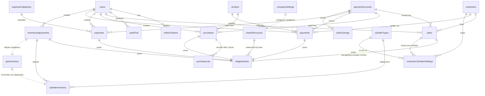

# Data Model — Collection Relationship Diagram

> Companion to `ARCHITECTURE.md` (Phase 4). Relationship map of the ~24 MongoDB collections. Planning only — not Mongoose schemas.
> Key conventions: money = integer minor units / `Decimal128` (F5); gas valued only in `gasInventory` (F1); every financial write emits one balanced `ledgerEntries` doc and (for tracked entities) one `auditTrail` doc, inside a transaction.

---

## ER diagram

> Singletons (`companySettings`, `gasInventory`) and standalone collections (`dailyRollups`, `idempotencyKeys`) use dotted/loose links because they aren't classic FK children.

---

## Relationship notes & cardinalities

| From | To | Cardinality | Nature |
|------|----|-------------|--------|
| users → refreshTokens | 1→N | session rotation family |
| users → sales/purchases/expenses/payments/adjustments | 1→N | `createdBy` (audit) |
| vendors → purchases | 1→N | supplier of each purchase |
| vendors → payments | 1→N | vendor payments (partyType=Vendor) |
| purchases → purchaseLots | 1→N | one lot per purchase line; WAC audit |
| customers → sales | 1→N | buyer |
| customers → customerCylinderHoldings | 1→N | shells currently/previously held |
| customers → payments | 1→N | receipts (partyType=Customer) |
| cylinderTypes → cylinderInventory | 1→N | one inventory row per type |
| cylinderTypes → customerCylinderHoldings | 1→N | type of each held shell |
| paymentAccounts → sales/purchases/payments/expenses | 1→N | which account money moved |
| paymentAccounts → cashClosings | 1→N | per-account daily close |
| {sales,purchases,payments,expenses,inventoryAdjustments} → ledgerEntries | 1→1 (or 1→N) | source event → balanced journal entry(ies) |
| chartOfAccounts → ledgerEntries.lines | 1→N | each line references an account code |
| gasInventory ↔ cylinderInventory | reconcile | `filledCount ≈ Σ(availableKg/capacityKg)` (F1) |

---

## Three layers of the model

**1. Master / reference (rarely change)**
`users`, `companySettings`, `chartOfAccounts`, `vendors`, `customers`, `cylinderTypes`, `expenseCategories`, `paymentAccounts`.

**2. Transactional (append-heavy, audited)**
`purchases`, `purchaseLots`, `sales`, `payments`, `expenses`, `inventoryAdjustments`, `customerCylinderHoldings`, `cashClosings`, `ledgerEntries`, `auditTrail`.

**3. Running state & infra (mutated atomically / derived)**
`gasInventory` (singleton, valued), `cylinderInventory` (counts), customer/vendor running balances (on master docs), `dailyRollups` (derived), `idempotencyKeys`, `refreshTokens`.

---

## Source-of-truth rules (must hold)
- **Gas value:** only `gasInventory` (1200). Cylinder counts carry no gas value (F1).
- **Financial truth:** `ledgerEntries` (double-entry). Master-doc running balances (`customer.currentReceivable`, `vendor.currentPayable`, `paymentAccount.currentBalance`) are *caches* that must agree with the ledger; reconcile in `dailyRollups`.
- **COGS:** `sales.unitCostAtSale` is the immutable snapshot (F3); never recomputed.
- **Mutations:** every write to a running-state doc happens inside `withTransaction` with its matching ledger + audit entry.

---

## Indexing summary (hot paths)
- `ledgerEntries`: `{date}`, `{sourceType, sourceId}`, `{ "lines.accountCode" }`, `{ "lines.partyId" }`.
- `sales`: `{invoiceNo}` unique, `{customerId}`, `{date}`, `{status}`.
- `purchases`: `{vendorId}`, `{date}`, `{status}`.
- `payments`: `{partyType, partyId}`, `{date}`.
- `customerCylinderHoldings`: `{customerId}`, `{status}`.
- `auditTrail`: `{entity, entityId}`, `{userId}`, `{timestamp}`.
- `dailyRollups` / `cashClosings`: `{businessDate}` unique.
- `idempotencyKeys`: `{key}` unique + TTL; `refreshTokens`: `{tokenHash}` unique + TTL.
